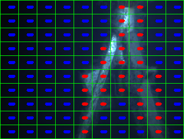

# AURlabCVsimulator
This repository is made for testing different computer vision methods by simulating a mission done in Trondheimsfjorden in April 2016

#### Libarys used

Python: 2.7.11 —Anaconda 2.5.0 (64-bit)
scipy: 0.17.0
numpy: 1.10.4
matplotlib: 1.5.1
pandas: 0.17.1
sklearn: 0.17

#### Mehtods that are being tested

image_prediction_lbp.png

Predicted image with lbp

### Mono camera methods also called the texture based methods
- LBP ROI method

Display maskedImage image

- Haralick ROI method

- SLIC SUperpixel Locally Binary Pattern method
- SLIC SUperpixel Harlick method

### Stereo camera methods
- Dipsarity method

### Folders of images

### Usefull links to understnad parts of the code faster

#### Unifrom Local Binary Pattern (watch this to understand better): 
- https://www.youtube.com/watch?annotation_id=annotation_98709127&feature=iv&src_vid=wpAwdsubl1w&v=v-gkPTvdgYo

####
- Lars Brusletto Master thesis
