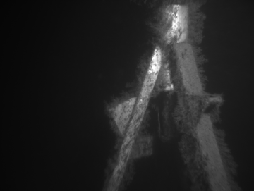
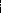
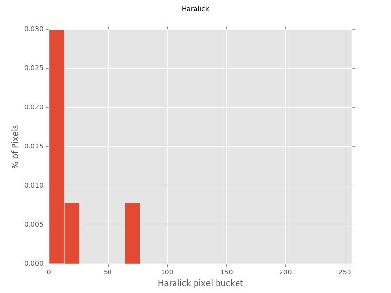
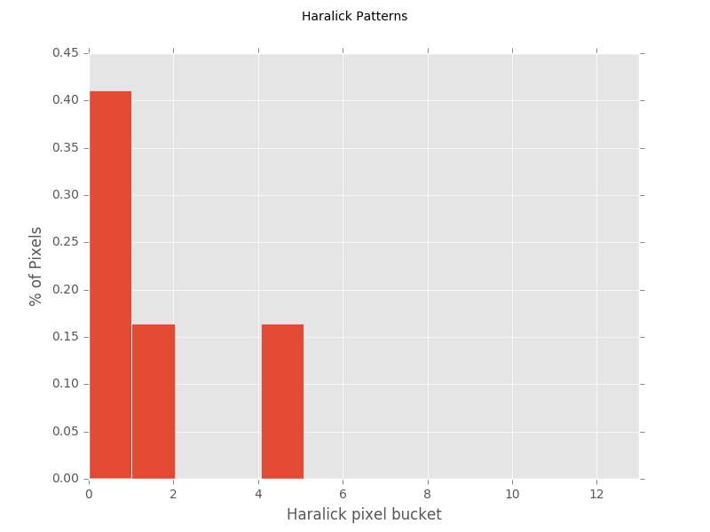
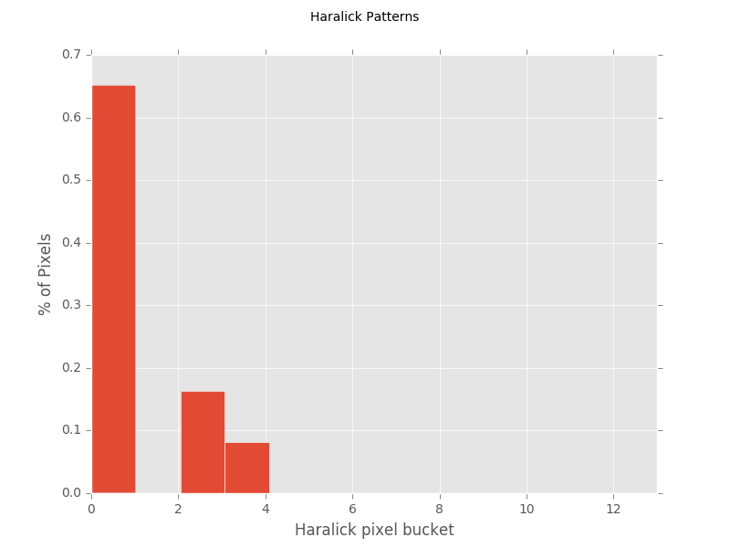

Import 


```python
# import the necessary packages
# for the Haralick descriptor
import mahotas

import matplotlib.pyplot as plt
import numpy as np
import argparse
import imutils
import cv2
```

Load the image


```python
def resizeImage(image):
    (h, w) = image.shape[:2]

    width = 360  #  This "width" is the width of the resize`ed image
    # calculate the ratio of the width and construct the
    # dimensions
    ratio = width / float(w)
    dim = (width, int(h * ratio))
    resized = cv2.resize(image, dim, interpolation=cv2.INTER_AREA)
    #resized = cv2.resize(image, dim, interpolation=cv2.INTER_CUBIC)
    return resized
```


```python
# 1 load the image
imagepath = r"tokt1_L_181.jpg"
# , double it in size, and grab the cell size
image = cv2.imread(imagepath)
#image = imutils.resize(image, width=image.shape[1] * 2, inter=cv2.INTER_CUBIC)

# 2 resize the image
image = resizeImage(image)
(h, w) = image.shape[:2]
#cellSize = 16 * 2
cellSize = h/10

# 3 convert the image to grayscale and show it
gray = cv2.cvtColor(image, cv2.COLOR_BGR2GRAY)
cv2.imshow("Image", gray)
cv2.waitKey(0)

# save the image
cv2.imwrite("docsIMG/gray_resized_image.png", gray)

```


    True


The image displayed


Construct the figures


```python
# construct the figure
plt.style.use("ggplot")
(fig, ax) = plt.subplots()
fig.suptitle("Haralick")
plt.ylabel("% of Pixels")
plt.xlabel("Haralick pixel bucket")

# plot a histogram of the LBP features and show it
#lbp = feature.local_binary_pattern(gray, 8, 1, method="default")
#lbp = feature.local_binary_pattern(gray, 10, 5, method="default")

#features = mahotas.features.haralick(image, ignore_zeros=True).mean(axis=0)
features = mahotas.features.haralick(gray, ignore_zeros=True).mean(axis=0)

cv2.imshow("LBP", features.astype("uint8"))
cv2.waitKey(0)

# Save figure of haralick_image
cv2.imwrite("docsIMG/haralick_image.png", features.astype("uint8"))

ax.hist(features.ravel(), normed=True, bins=20, range=(0, 256))
ax.set_xlim([0, 256])
ax.set_ylim([0, 0.030])
# save figure
fig.savefig('docsIMG/haralick_histogram.png')   # save the figure to file
plt.show()

cv2.destroyAllWindows()
#######################################################################

# create the 3D grayscale image
stacked = np.dstack([gray] * 3)

# Draw the box around area
# Divide the image into 100 pieces
(h, w) = stacked.shape[:2]
cellSizeYdir = h / 10
cellSizeXdir = w / 10

# Draw the box around area
# loop over the x-axis of the image
for x in xrange(0, w, cellSizeXdir):
    # draw a line from the current x-coordinate to the bottom of
    # the image
 
    cv2.line(stacked, (x, 0), (x, h), (0, 255, 0), 1)
    #   
# loop over the y-axis of the image
for y in xrange(0, h, cellSizeYdir):
    # draw a line from the current y-coordinate to the right of
    # the image
    cv2.line(stacked, (0, y), (w, y), (0, 255, 0), 1)

# draw a line at the bottom and far-right of the image
cv2.line(stacked, (0, h - 1), (w, h - 1), (0, 255, 0), 1)
cv2.line(stacked, (w - 1, 0), (w - 1, h - 1), (0, 255, 0), 1)

#cv2.imshow("stacked", stacked)
#cv2.waitKey(0)

```

The image displayed


The lbp histogram of the whole image


Display the figures


```python

# construct the figure
plt.style.use("ggplot")
(fig, ax) = plt.subplots()
fig.suptitle("Haralick Patterns")
plt.ylabel("% of Pixels")
plt.xlabel("Haralick pixel bucket")

# extract the ROI from the image
#start = cellSize * 6  #3
#end = cellSize *7 # 4
#roi = gray[start:end, start:end]
#roi = gray[cellSizeXdir*6:cellSizeXdir*7, cellSizeYdir*6:cellSizeYdir*7]
roi = gray[cellSizeXdir*5:cellSizeXdir*6, cellSizeYdir*5:cellSizeYdir*6]

# Draw a red box around ROI
#cv2.rectangle(stacked, (start, start), (end, end), (0, 0, 255), 2)
cv2.rectangle(stacked, (cellSizeXdir*5, cellSizeYdir*5), (cellSizeXdir*6, cellSizeYdir*6), (0, 0, 255), 2)


# plot a histogram of the LBP uniform feature and show the output
#lbp = feature.local_binary_pattern(roi, 24, 3, method="uniform")
#features = mahotas.features.haralick(roi, ignore_zeros=True).mean(axis=0)
features = mahotas.features.haralick(roi, ignore_zeros=False).mean(axis=0)
print(features.shape)


print len(np.unique(features))
n_bins = len(np.unique(features))
print n_bins


# The length or dimensionality of a feature vector 
# is determined by how many entries in the last there are not the maximum value + 1.

ax.hist(features.ravel(), normed=True, bins=n_bins, range=(0, n_bins))
#ax.hist(features.ravel(), normed=True, bins=13, range=(0, 14))

cv2.imshow("{}px x {}px".format(cellSize, cellSize), stacked)
cv2.waitKey(0)
# save figure
fig.savefig("docsIMG/haralick_histogramofROI_onStructure.png")   # save the figure to file
plt.show()


# Save figure of grid with ROI
cv2.imwrite("docsIMG/grid_withRoi_haralick_onStructure.png", stacked)
```

    (13L,)
    13
    13
    


    True


The image displayed


The Haralick histogram



Plot a histogram of "ocean"


```python

# construct the figure
plt.style.use("ggplot")
(fig, ax) = plt.subplots()
fig.suptitle("Haralick Patterns")
plt.ylabel("% of Pixels")
plt.xlabel("Haralick pixel bucket")

# extract the ROI from the image
roi = gray[cellSizeXdir*3:cellSizeXdir*4, cellSizeYdir*3:cellSizeYdir*4]

# Draw a red box around ROI
cv2.rectangle(stacked, (cellSizeXdir*3, cellSizeYdir*3), (cellSizeXdir*4, cellSizeYdir*4), (255, 0, 0), 2)


# plot a histogram of the Haralick feature and show the output
#features = mahotas.features.haralick(roi, ignore_zeros=True).mean(axis=0)

features = mahotas.features.haralick(roi, ignore_zeros=False).mean(axis=0)

print len(np.unique(features))
#ax.hist(features.ravel(), normed=True, bins=13, range=(0, 14))
n_bins = len(np.unique(features))
ax.hist(features.ravel(), normed=True, bins=n_bins, range=(0, n_bins))

#ax.set_xlim([0, 26])
#ax.set_xlim([0,13])

cv2.imshow("{}px x {}px".format(cellSize, cellSize), stacked)
cv2.waitKey(0)
# save figure
fig.savefig("docsIMG/haralick_histogramofROI_onOcean.png")   # save the figure to file
plt.show()


# Save figure of grid with ROI
cv2.imwrite("docsIMG/grid_withRoi_haralick_onOcean.png", stacked)
```

    13
    


    True


The image displayed


The Haralick histogram



```python

```
