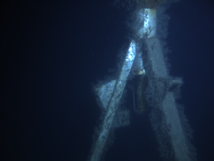
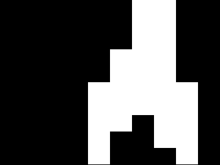
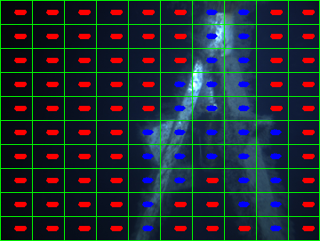

# Prediction

0 - load libary

1.1 - Load model

1.2 - load test image

2 - Predict using model


```python
# Import the necessary packages

# for the lbp
from skimage import feature

# Classifier
from sklearn.svm import LinearSVC

# to save and load, the model that is created from the classification
from sklearn.externals import joblib

import matplotlib.pyplot as plt
import numpy as np
import argparse
import imutils
import cv2
```


```python
def resizeImage(image):
    (h, w) = image.shape[:2]

    width = 360  #  This "width" is the width of the resize`ed image
    # calculate the ratio of the width and construct the
    # dimensions
    ratio = width / float(w)
    dim = (width, int(h * ratio))
    resized = cv2.resize(image, dim, interpolation=cv2.INTER_AREA)
    #resized = cv2.resize(image, dim, interpolation=cv2.INTER_CUBIC)
    return resized
```

1.1 - Load model


```python
# loadModel
model = joblib.load("model/filename_model.pkl")
```

2 Predict with the model

-  go thru all the squares and extract the feature vector

- used .predict

- mask the square if prediction == "other"


-- Return masked image


```python
# Feature extraction
class LocalBinaryPatterns(object):
    # this class is from: http://www.pyimagesearch.com/2015/12/07/local-binary-patterns-with-python-opencv/
    def __init__(self, numPoints, radius):
        # store the number of points and radius
        self.numPoints = numPoints
        self.radius = radius

    def describe(self, image, eps=1e-7):
        # Compute the Local Binary Pattern representation
        # of the image, and then use the LBP representation
        # to build the histogram of patterns
        lbp = feature.local_binary_pattern(image, self.numPoints, self.radius, method= "uniform" ) # method= "ror") #method="var")# method="nri_uniform")  # method="uniform")
        # using unifrom binary pattern (watch this to understand better): https://www.youtube.com/watch?annotation_id=annotation_98709127&feature=iv&src_vid=wpAwdsubl1w&v=v-gkPTvdgYo
        # different merhod= --> http://scikit-image.org/docs/dev/api/skimage.feature.html?highlight=local_binary_pattern#skimage.feature.local_binary_pattern
        (hist, _) = np.histogram(lbp.ravel(),
            bins=np.arange(0, self.numPoints + 3),
            range=(0, self.numPoints + 2))

        # Normalize the histogram
        hist = hist.astype("float")
        hist /= (hist.sum() + eps)

        # return the histogram of Local Binary Patterns
        return hist
```


```python
def predictMaskedImage(image):
    
    # get the descriptor class initiated
    desc = LocalBinaryPatterns(10, 5)

    imageROIList = []
    predictionList = []
    centerList = []

    # This mask has the same width and height a the original image and has a default value of 0 (black).
    maskedImage = np.zeros(image.shape[:2], dtype="uint8")
    ########### create imageROIList here ############

    (h, w) = image.shape[:2]

    # Divide the image into 100 pieces
    cellSizeYdir = h / 10
    cellSizeXdir = w / 10

    # start in origo
    x = 0
    y = 0
    counterInt = 0
    
    #######################################
    
       # 10*10 = 100
    for i in xrange(10):

        # update this value
        y = cellSizeYdir * (i)
        
        x = 0 # it starts at 0 for a new row
        for j in xrange(10):
            # print "[x] inspecting imageROI %d" % (counterInt)
            counterInt = counterInt + 1
            
            x = cellSizeXdir * (j)
            
            imageROI = image[y: cellSizeYdir * (i+1), x:cellSizeXdir * (j+1)]
            
            #print "ystart  " + str(y) + "  yjump  " + str((cellSizeYdir * (i+1)))
            #print "xstart  " + str(x) +  "  xjump  " + str((cellSizeXdir * (j+1)))
            
            
            centerPos = (   cellSizeXdir * (j+1) - (cellSizeXdir)/2, cellSizeYdir * (i+1) - (cellSizeYdir)/2)
            centerList.append(centerPos)
    
            #########################################

            # grayscale and calculate histogram
            grayImageROI = cv2.cvtColor(imageROI, cv2.COLOR_BGR2GRAY)
            hist = desc.describe(grayImageROI)

            # need prediction to mask image
            #model = model
            if model == None:
                print "it was none"
                
            # reshape the histogram to work with sci kit learn
            histNew = np.reshape(hist, (1, len(hist)))
            
            prediction = model.predict(histNew)[0]
            predictionList.append(prediction)

            #prediction = model.predict(hist)[0]
            #predictionList.append(prediction)

            # HERE the returned maskedImage is created
            # construct a mask for the segment
            if prediction == "other":
                maskedImage[y:y + cellSizeYdir, x:x + cellSizeXdir] = 255

            if prediction == "ocean":
                maskedImage[y:y + cellSizeYdir, x:x + cellSizeXdir] = 0

    return maskedImage, predictionList, centerList
```

### 1.2 load image to predict


```python
# 1.2 load image to predict

path = r"trainingIMG/test.jpg"
imageTest = cv2.imread(path)

# 2 resize the image
imageTest = resizeImage(imageTest)

#cv2.imshow("testimage", imageTest )
#cv2.waitKey(0)

cv2.imwrite("docsIMG/imageTest.png", imageTest)

```


    True


Display testing image



### 2 predict using model


```python
# 2 predict using model

maskedImage, predictionList, centerList = predictMaskedImage(imageTest)

#cv2.imshow("maskedImage", maskedImage )
#cv2.waitKey(0)

# save image

cv2.imwrite("docsIMG/maskedImage.png", maskedImage)

```


    True


Display maskedImage image


# Make fancy figure to look cool in your theisis!!


```python
# create the 3D grayscale image --> so that I can make color squares for figures to the thesis
# This does not change the histograms created.
#stacked = np.dstack([gray] * 3)

image_shit = imageTest.copy()

# Divide the image into 100 pieces
(h, w) = image_shit.shape[:2]
cellSizeYdir = h / 10
cellSizeXdir = w / 10

# Draw the box around area
# loop over the x-axis of the image
for x in xrange(0, w, cellSizeXdir):
    # draw a line from the current x-coordinate to the bottom of
    # the imagez
    cv2.line(image_shit, (x, 0), (x, h), (0, 255, 0), 1)
    #   
# loop over the y-axis of the image
for y in xrange(0, h, cellSizeYdir):
    # draw a line from the current y-coordinate to the right of
    # the image
    cv2.line(image_shit, (0, y), (w, y), (0, 255, 0), 1)

# draw a line at the bottom and far-right of the image
cv2.line(image_shit, (0, h - 1), (w, h - 1), (0, 255, 0), 1)
cv2.line(image_shit, (w - 1, 0), (w - 1, h - 1), (0, 255, 0), 1)

# put the prediction text on top
 # show the output of the prediction with text
print len(predictionList)    
print len(centerList)

for (i, predVal) in enumerate(predictionList):
    CORD = centerList[i]
    if predictionList[i] == "other":
        colorFont = (255, 0, 0)  # "Blue color for other"
    else:
        colorFont = (0, 0, 255)  # "Red color for ocean"

    testOrg = (40, 40)  # need this for the if statment bellow

    # for some yet unknown reason CORD does sometime contain somthing like this [[[210 209]] [[205 213]] ...]
    # the following if statment is to not get a error becouse of this
    if len(CORD) == len(testOrg):
        textOrg = CORD
        cv2.putText(image_shit, predictionList[i], textOrg, cv2.FONT_HERSHEY_SIMPLEX, 0.1, colorFont, 3)
        
    else:
        pass

# show the important shit you did here
cv2.imshow("image_shit", image_shit)
cv2.waitKey(0)


cv2.imwrite("docsIMG/image_shit.png", image_shit)
```

    100
    100
    


    True


The image displayed



```python

```
