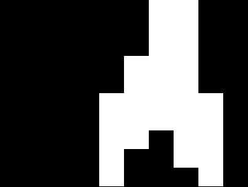
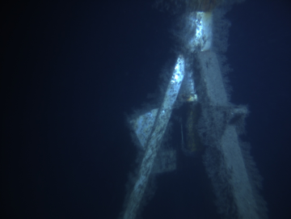
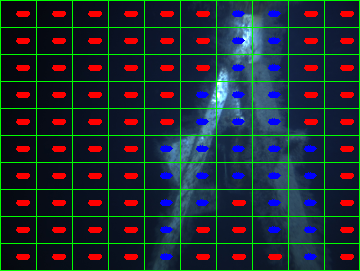

# Prediction

0 - load libary

1 - Load model

2 - Predict with model

3 - Avoid obstacle

############################################################################################################

0 - load libary


```python
# Import the necessary packages

# for the Haralick descriptor
import mahotas

# Classifier
from sklearn.svm import LinearSVC

# To save and load, the model that is created from the classification
from sklearn.externals import joblib

import matplotlib.pyplot as plt
import numpy as np
import argparse
import imutils
import cv2
```

1 - Load image of "ocean" and "other"


```python
def resizeImage(image):
    (h, w) = image.shape[:2]

    width = 360  #  This "width" is the width of the resize`ed image
    # calculate the ratio of the width and construct the
    # dimensions
    ratio = width / float(w)
    dim = (width, int(h * ratio))
    resized = cv2.resize(image, dim, interpolation=cv2.INTER_AREA)
    #resized = cv2.resize(image, dim, interpolation=cv2.INTER_CUBIC)
    return resized
```

1 - Load model


```python
# loadModel
model = joblib.load("model/filename_model.pkl")
```

2 Predict with the model

-  go thru all the squares and extract the feature vector

- used .predict

- mask the square if prediction == "other"


-- Return masked image


```python
# Feature extraction
class Haralick:
    # this mehtod is a Harlick discriptor
    # it uses the mahotas library

    def describe(self, image, eps=1e-7):
        # it should send in a grayscale image in the describe function
        #extract Haralick texture features in 4 directions, then take the
        # mean of each direction
        # ignore_zeros=True since i have masked the image, and therefore we want to ignore black color == 0 (zeroes)
        features = mahotas.features.haralick(image, ignore_zeros=True).mean(axis=0)

        # return the haralick feature
        return features
```


```python
def predictMaskedImage(image):
    
    # get the descriptor class initiated
    #desc = LocalBinaryPatterns(10, 5)
    desc = Haralick()

    imageROIList = []
    predictionList = []
    centerList = []

    # This mask has the same width and height a the original image and has a default value of 0 (black).
    maskedImage = np.zeros(image.shape[:2], dtype="uint8")
    ########### create imageROIList here ############

    (h, w) = image.shape[:2]

    # Divide the image into 100 pieces
    cellSizeYdir = h / 10
    cellSizeXdir = w / 10

    # start in origo
    x = 0
    y = 0
    counterInt = 0
    
    #######################################
    
       # 10*10 = 100
    for i in xrange(10):

        # update this value
        y = cellSizeYdir * (i)
        
        x = 0 # it starts at 0 for a new row
        for j in xrange(10):
            #print "[x] inspecting imageROI %d" % (counterInt)
            counterInt = counterInt + 1
            
            x = cellSizeXdir * (j)
            
            imageROI = image[y: cellSizeYdir * (i+1), x:cellSizeXdir * (j+1)]
            
            #print "ystart  " + str(y) + "  yjump  " + str((cellSizeYdir * (i+1)))
            #print "xstart  " + str(x) +  "  xjump  " + str((cellSizeXdir * (j+1)))
            
            
            centerPos = (   cellSizeXdir * (j+1) - (cellSizeXdir)/2, cellSizeYdir * (i+1) - (cellSizeYdir)/2)
            centerList.append(centerPos)
    
            #########################################

            # grayscale and calculate histogram
            grayImageROI = cv2.cvtColor(imageROI, cv2.COLOR_BGR2GRAY)
            hist = desc.describe(grayImageROI)

            # need prediction to mask image
            #model = model
            if model == None:
                print "it was none"
                
            # reshape the histogram to work with sci kit learn
            histNew = np.reshape(hist, (1, len(hist)))
            
            prediction = model.predict(histNew)[0]
            predictionList.append(prediction)

            #prediction = model.predict(hist)[0]
            #predictionList.append(prediction)

            # HERE the returned maskedImage is created
            # construct a mask for the segment
            if prediction == "other":
                maskedImage[y:y + cellSizeYdir, x:x + cellSizeXdir] = 255

            if prediction == "ocean":
                maskedImage[y:y + cellSizeYdir, x:x + cellSizeXdir] = 0

    return maskedImage, predictionList, centerList
```


```python
# load image to predict

path = r"trainingIMG/test.jpg"
imageTest = cv2.imread(path)

# 2 resize the image
imageTest = resizeImage(imageTest)

cv2.imshow("testimage", imageTest )
cv2.waitKey(0)

maskedImage, predictionList, centerList = predictMaskedImage(imageTest)

cv2.imshow("maskedImage", maskedImage )
cv2.waitKey(0)

# save the image
cv2.imwrite("docsIMG/maskedImage.png", maskedImage)
cv2.imwrite("docsIMG/imageTest.png", imageTest)
```


    True


The images displayed




### Make fancy figure to display the prediction


```python
# create the 3D grayscale image --> so that I can make color squares for figures to the thesis
# This does not change the histograms created.
#stacked = np.dstack([gray] * 3)


image_predicted = imageTest.copy()

# Divide the image into 100 pieces
(h, w) = image_predicted.shape[:2]
cellSizeYdir = h / 10
cellSizeXdir = w / 10

# Draw the box around area
# loop over the x-axis of the image
for x in xrange(0, w, cellSizeXdir):
    # draw a line from the current x-coordinate to the bottom of
    # the imagez
    
    #cv2.line(image_predicted, (x, 0), (x, cellSizeXdir * (j + 1)), (0, 255, 0), 1)
    cv2.line(image_predicted, (x, 0), (x, h), (0, 255, 0), 1)
    #   
# loop over the y-axis of the image
for y in xrange(0, h, cellSizeYdir):
    # draw a line from the current y-coordinate to the right of
    # the image
    cv2.line(image_predicted, (0, y), (w, y), (0, 255, 0), 1)

# draw a line at the bottom and far-right of the image
cv2.line(image_predicted, (0, h - 1), (w, h - 1), (0, 255, 0), 1)
cv2.line(image_predicted, (w - 1, 0), (w - 1, h - 1), (0, 255, 0), 1)

# put the prediction text on top
 # show the output of the prediction with text
print len(predictionList)    
print len(centerList)

for (i, predVal) in enumerate(predictionList):
    CORD = centerList[i]
    if predictionList[i] == "other":
        colorFont = (255, 0, 0)  # "Blue color for other"
    else:
        colorFont = (0, 0, 255)  # "Red color for ocean"

    # textOrg = CORD
    # textOrg = tuple(numpy.subtract((10, 10), (4, 4)))

    testOrg = (40, 40)  # need this for the if statment bellow

    # for some yet unknown reason CORD does sometime contain somthing like this [[[210 209]] [[205 213]] ...]
    # the following if statment is to not get a error becouse of this
    if len(CORD) == len(testOrg):
        # textOrg = tuple(np.subtract(CORD, (12, 0)))
        textOrg = CORD
        cv2.putText(image_predicted, predictionList[i], textOrg, cv2.FONT_HERSHEY_SIMPLEX, 0.1, colorFont, 3)
        
    else:
        pass

# show the image_predicted here
cv2.imshow("image_predicted", image_predicted)
cv2.waitKey(0)

# save image
cv2.imwrite("docsIMG/image_predicted.png", image_predicted)
```

    100
    100
    


    True


The image displayed



```python

```
