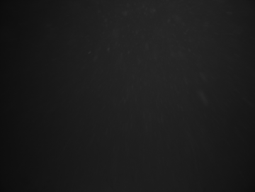

### Train model 

0 - import the necessary packages

1.1 - Load image of "ocean" and "other"

1.2 - resize image

2 - make 100 imageROI described as histogram out of each training images

3 - label the ones from the first image as "ocean" and the other ones for "other"

4 - calculate the feature descriptor

5 - send the quatified feature vector together with the label "name" in into the SVMC

6 - save the created model

0 -- import the necessary packages


```python
# import the necessary packages

# for the lbp
#from skimage import feature

# for the Haralick descriptor
import mahotas

# Classifier
from sklearn.svm import LinearSVC

# to save and load, the model that is created from the classification
from sklearn.externals import joblib

import matplotlib.pyplot as plt
import numpy as np
import argparse
import imutils
import cv2
```

1 - Load image of "ocean" and "other"


```python
def resizeImage(image):
    (h, w) = image.shape[:2]

    width = 360  #  This "width" is the width of the resize`ed image
    # calculate the ratio of the width and construct the
    # dimensions
    ratio = width / float(w)
    dim = (width, int(h * ratio))
    resized = cv2.resize(image, dim, interpolation=cv2.INTER_AREA)
    #resized = cv2.resize(image, dim, interpolation=cv2.INTER_CUBIC)
    return resized
```


```python

# 1 load the image
imagepathOcean = r"trainingIMG/ocean.jpg"
imageOcean = cv2.imread(imagepathOcean)

imagepathOther = r"trainingIMG/NemoReef.jpg"
imageOther = cv2.imread(imagepathOther)

#imagepathOther = r"trainingIMG/raptors.png"
#imageOther = cv2.imread(imagepathOther)

# 2 resize the image
imageOcean = resizeImage(imageOcean)
(h, w) = imageOcean.shape[:2]
cellSize = h/10

imageOther = resizeImage(imageOther)
(h, w) = imageOther.shape[:2]
cellSize = h/10

# 3 convert the image to grayscale and show it
imageOceanGray = cv2.cvtColor(imageOcean, cv2.COLOR_BGR2GRAY)
cv2.imshow("ImageoceanGray", imageOceanGray)
cv2.waitKey(0)

imageOtherGray = cv2.cvtColor(imageOther, cv2.COLOR_BGR2GRAY)
cv2.imshow("ImageotherGray", imageOtherGray)
cv2.waitKey(0)

# save the image
cv2.imwrite("docsIMG/gray_resized_imageOcean.png", imageOceanGray)
cv2.imwrite("docsIMG/gray_resized_imageOther.png", imageOtherGray)

```


    True


The image displayed



2 - make 100 imageROI described as histogram out of each training images

3 - label the ones from the first image as "ocean" and the other ones for "other"

4 - calculate the feature descriptor


```python
# Feature extraction
class Haralick:
    # this mehtod is a Harlick discriptor
    # it uses the mahotas library

    def describe(self, image, eps=1e-7):
        # it should send in a grayscale image in the describe function
        #extract Haralick texture features in 4 directions, then take the
        # mean of each direction
        # ignore_zeros=True since i have masked the image, and therefore we want to ignore black color == 0 (zeroes)
        features = mahotas.features.haralick(image, ignore_zeros=True).mean(axis=0)

        # return the haralick feature
        return features
```


```python
def extractHistogramList(image, label):

    # get the descriptor class initiated
    #desc = LocalBinaryPatterns(10, 5)
    desc = Haralick()
        
    histogramList = []
    LabelList = []

    # This mask has the same width and height a the original image and has a default value of 0 (black).
    maskedImage = np.zeros(image.shape[:2], dtype="uint8")
    ########### create imageROIList here ############

    (h, w) = image.shape[:2]

    # Divide the image into 100 pieces
    cellSizeYdir = h / 10
    cellSizeXdir = w / 10

    # start in origo
    x = 0
    y = 0
    counterInt = 0

    # 10*10 = 100
    for i in xrange(10):

        # update this value
        y = cellSizeYdir * (i)
        
        x = 0 # it starts at 0 for a new row
        for j in xrange(10):
            #print "[x] inspecting imageROI %d" % (counterInt)
            counterInt = counterInt + 1
            
            x = cellSizeXdir * (j)
            
            imageROI = image[y: cellSizeYdir * (i+1), x:cellSizeXdir * (j+1)]
            
            #print "ystart  " + str(y) + "  yjump  " + str((cellSizeYdir * (i+1)))
            #print "xstart  " + str(x) +  "  xjump  " + str((cellSizeXdir * (j+1)))

            # grayscale and calculate histogram
            grayImageROI = cv2.cvtColor(imageROI, cv2.COLOR_BGR2GRAY)
            hist = desc.describe(grayImageROI)
            
            histogramList.append(hist)
            LabelList.append(label)
            
    return histogramList, LabelList                                               
```


```python

# describe ocean
histogramListOcean, oceanLabelList = extractHistogramList(imageOcean, "ocean")

# describe other
histogramListOther, otherLabelList = extractHistogramList(imageOther, "other")

```

5 - send the quantified feature vector together with the label "name" in into the SVMC

6 - save the created model


```python
dataList = histogramListOcean + histogramListOther
labelsList = oceanLabelList + otherLabelList

# Train a Linear SVM on the data
model = LinearSVC(C=100.0, random_state=42)
model.fit(dataList, labelsList)

#self.saveModel(model)
joblib.dump(model, "model/filename_model.pkl")
```


    ['model/filename_model.pkl',
     'model/filename_model.pkl_01.npy',
     'model/filename_model.pkl_02.npy',
     'model/filename_model.pkl_03.npy']


```python

```
