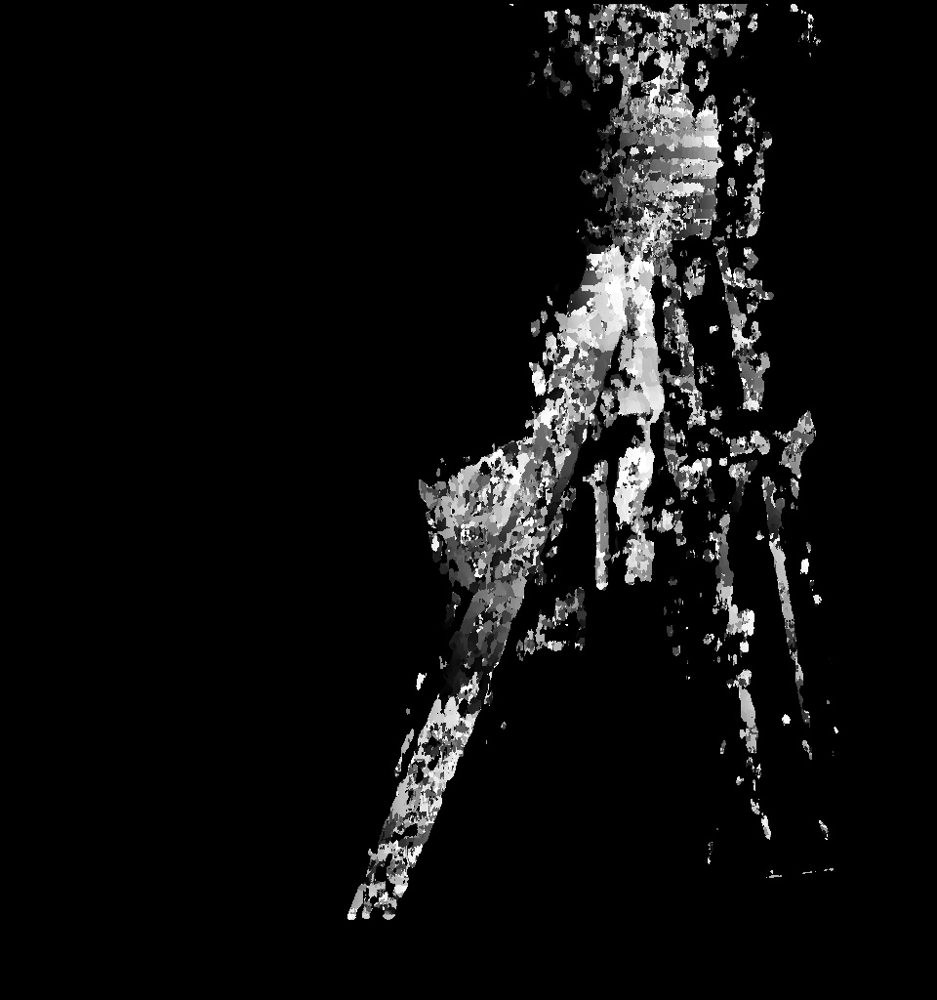
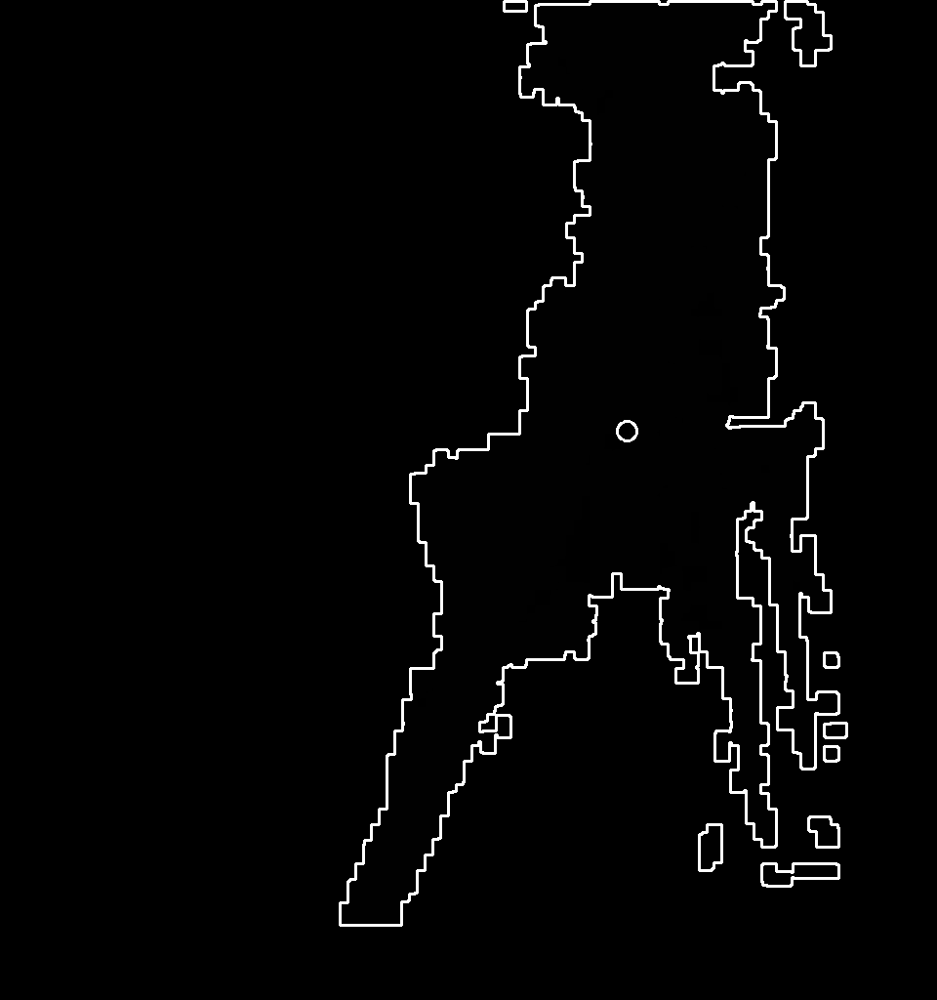
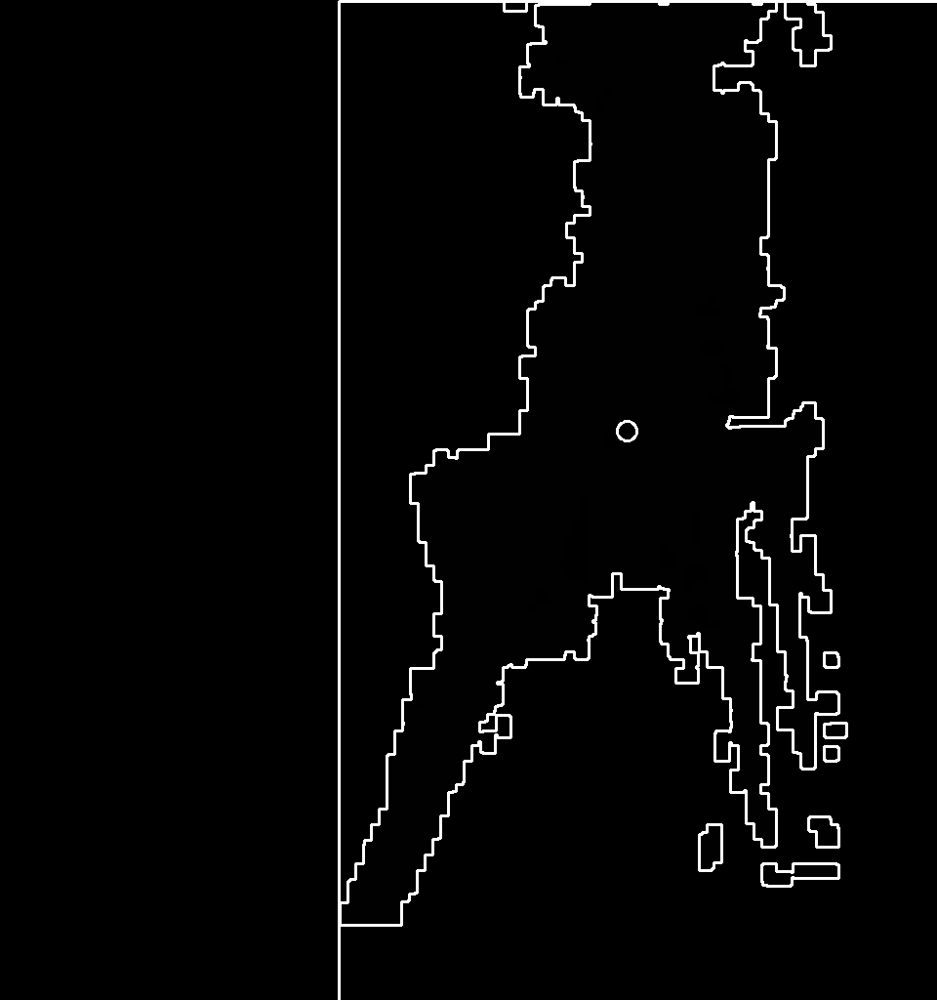

# Finding the center of the disparity image


```python
# import neccasary pacages
import numpy as np
import cv2

# load disparity image
image = cv2.imread("disparity_visualBW_23.jpg")

print str(image.dtype)

cv2.imshow("image", image)
cv2.waitKey(0)

# save the image
cv2.imwrite("docsIMG/disparity_image.png", image)

```

    uint8
    


    True


The image displayed


### Extract the countour

-->  draw the coutour for vizualization 


```python
# import neccasary pacages
import numpy as np
import cv2

# load disparity image
#image = cv2.imread("C:\CV_projects\AURlabCVsimulator\notebooks\countours\disparity_visualBW_23.jpg")
image = cv2.imread("disparity_visualBW_23.jpg")

# The image need to be monochrome i.e only one channel --> no (r,g,b)
# to be able to run findContours
imageMono= image
imageMono = cv2.cvtColor(image, cv2.cv.CV_BGR2GRAY)
#image = imageMono

# make image abs
#image = cv2.convertScaleAbs(image)

# prepare image for centroid calculations
# DILATE white points...
imageMono = cv2.dilate(imageMono, np.ones((5, 5)))
imageMono = cv2.dilate(imageMono, np.ones((5, 5)))

#image = image.astype(np.uint8)

# find all contours in the image and draw ALL contours on the image
#(cnts, _) = cv2.findContours(image.copy(), cv2.RETR_LIST, cv2.CHAIN_APPROX_SIMPLE)
(contours0, _) = cv2.findContours(imageMono, cv2.RETR_EXTERNAL, cv2.CHAIN_APPROX_SIMPLE)
clone = imageMono.copy()
cv2.drawContours(clone, contours0, -1, (255, 255, 255), 2)
print "Found {} contours".format(len(contours0))

# show the output image
cv2.imshow("All Contours", clone)
cv2.waitKey(0)

# save the image
cv2.imwrite("docsIMG/All_Contours_disparity.png", clone)

```

    Found 9 contours
    


    True


The image displayed


The image displayed

###  Finding the center of the object

Since there is different sizes of coutours, we need a way to weigh them so we get the average center of all the area seen.

##### The geometric center is given by summing up all then centroids respective x and y position and multiplying them with there respective "Area".
area = cv2.contourArea(cnt)

m = cv2.moments(cnt)

centroid_X = [area *int(round(m['m10']/m['m00']))]

centroid_y = [area *int(round(m['m01']/m['m00']))]

#### Then to Average all the centroids we divide by the totale Area given the folowing formula

centroid_XList/areaTot

centroid_YList/areaTot

Before we sum up alle the "scaled" x and y positions to tp give the real centers. 

C_X = np.sum(centroid_XListCenters)

C_Y = np.sum(centroid_YListCenters) 


```python
centroid_XList = []
centroid_YList = []

areaTot = 0
for (i, cnt) in enumerate(contours0):
    area = cv2.contourArea(cnt)
    
    # compute the moments of the contour
    # use the moments to compute the "center of mass" of each contour
    m = cv2.moments(cnt)
    centroid_X = [area *int(round(m['m10']/m['m00']))]
    centroid_y = [area *int(round(m['m01']/m['m00']))]
    
    centroid_XList.append(centroid_X)
    centroid_YList.append(centroid_y)
    
    areaTot = areaTot + area
    
centroid_XList = np.asarray(centroid_XList)
centroid_YList = np.asarray(centroid_YList)

# take the average
centroid_XListCenters = centroid_XList/areaTot
centroid_YListCenters = centroid_YList/areaTot

# sum the points and cast to int so cv2.draw works
objectCenterX = int(np.sum(centroid_XListCenters))
objectCenterY = int(np.sum(centroid_YListCenters))

print objectCenterX
print objectCenterY
```

    642
    441
    

### Draw the center on the image to check it is correct


```python
# Unpack tuple.
#objectCenterX = int(objectCenterX)
#objectCenterY = int(objectCenterY)

# draw the center of the object on the image
cv2.circle(clone, (objectCenterX, objectCenterY), 10, (255, 255, 255), 2)

# show the output image
cv2.imshow("All Contours + center", clone)
cv2.waitKey(0)

# save the image
cv2.imwrite("docsIMG/All_Contours_and_center_disparity.png", clone)
```


    True


The image displayed


## Get the centerCodinates for drawing purposes later


```python
########################################
moments = [cv2.moments(cnt) for cnt in contours0]
centroids = [( int(round(m['m10']/m['m00'])), int(round(m['m01']/m['m00'])) ) for m in moments]
centerCordinates = []
for ctr in centroids:
    centerCordinates.append(ctr)
centerCordinates = np.asarray(centerCordinates)
#########################################
```

### Make a bounding box with  some margin around the obstacle 


```python
(contours0, _) = cv2.findContours(clone.copy(), cv2.RETR_EXTERNAL, cv2.CHAIN_APPROX_SIMPLE)

xLast, yLast = clone.shape[:2]
wLast = 0
hLast = 0

for c in contours0:
    # fit a bounding box to the contour
    (x, y, w, h) = cv2.boundingRect(c)
    
    if(xLast > x):
        xLast = x
        
    if(yLast > y):
        yLast = y
        
    #if (wLast < w):
    wLast = wLast + w
        
    #if (hLast < h):
    hLast = hLast + h
    
    print "x : " + str(x)
    print "y : " + str(y)
    print "w : " + str(w)
    

cv2.rectangle(clone, (xLast, yLast), (xLast + wLast, yLast + hLast), (255, 255, 255), 2)
        

# Display the drawn image
cv2.imshow("drawnImage", clone)
cv2.waitKey(0)

# save the image
cv2.imwrite("docsIMG/drawnImage_boundingBox_disparity.png", clone)
```

    x : 779
    y : 883
    w : 82
    x : 715
    y : 843
    w : 26
    x : 827
    y : 835
    w : 34
    x : 843
    y : 763
    w : 18
    x : 843
    y : 739
    w : 26
    x : 843
    y : 667
    w : 18
    x : 803
    y : 1
    w : 50
    x : 347
    y : 1
    w : 514
    x : 515
    y : 1
    w : 26
    


    True


The image displayed



```python

```
